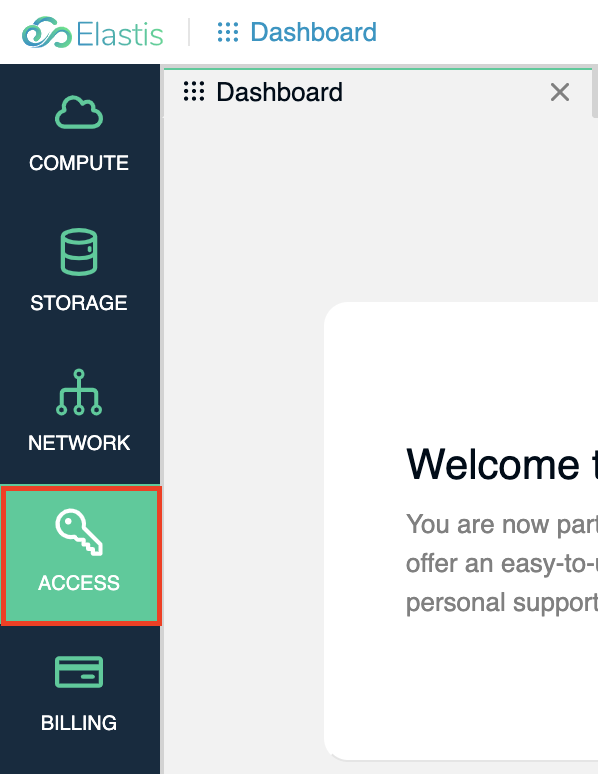
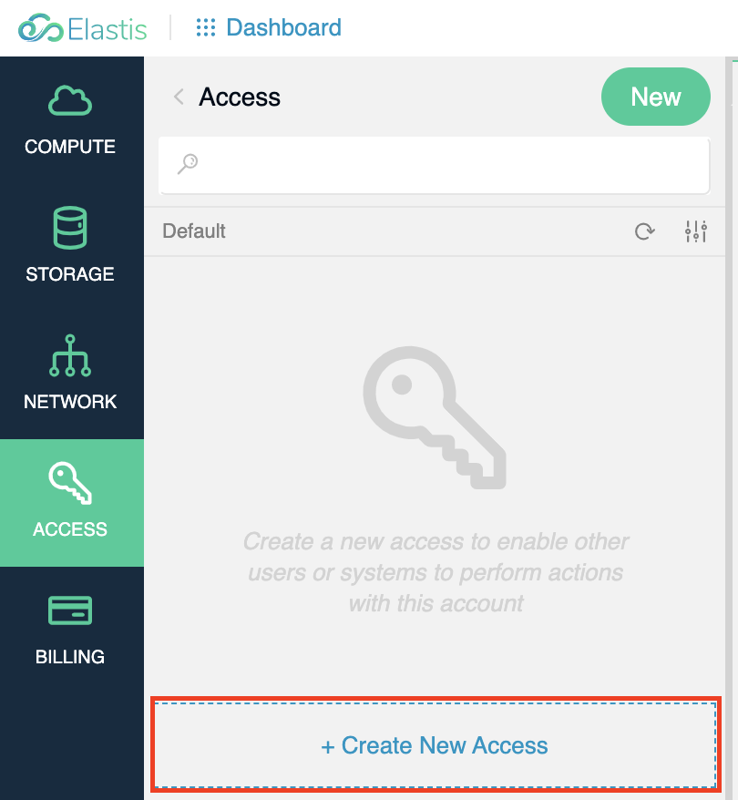
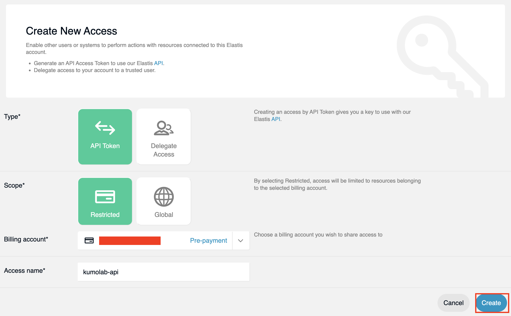
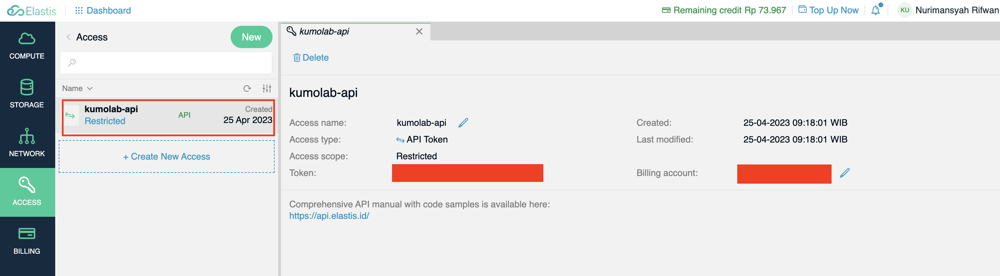

# Elastis.id Terraform Provider #

## Getting Started - Development ##
- Create or modify `$HOME/.terraformrc` file with:
```
provider_installation {
  dev_overrides {
    "elastis.id/provider/elastis" = "<YOUR_GOBIN_DIRECTORY>"
  }

  direct {}
}
```
- Run `go mod tidy` for downloading dependencies
- Then, you can begin development
- To verify, run `make` and then you can browse `examples` directory
- Finally, you can run any `terraform` command

## Production Usage ##
- First, make sure you disable/delete `$HOME/.terraformrc` file
- Next, run `terraform init`
- Then, copy `examples/main.tf` and `examples/version.tf` files to your project
- Next, open [Release](https://github.com/nurimansyah89/terraform-elastis-provider/releases) page and download release based on your OS architecture
- After that, create directory (if not exist) in `$HOME/.terraform.d/plugins/elastis.id/provider/elastis/<VERSION>/<OS_ARCH>`
  - `VERSION` must same with the release version
  - `OS_ARCH` is your operating system architecture, for example `linux_amd64` or `darwin_amd64` or else
- Then, move downloaded bin to your `$HOME/.terraform.d/plugins/elastis.id/provider/elastis/<VERSION>/<OS_ARCH>`
- Don't forget to change the permission to execute the binary
- Finally you can use the `terraform` cli commands inside your project with `.tf` files

---

Or, if you have golang in your machine, do following:
- Delete `$HOME/.terraformrc` file
- Clone this repo
- Run `go mod tidy`
- Finally, run `make build VER=0.1.0 ARCH=YOUR_OS_ARCH`
- It will install this provider locally

> NOTE: For golang usage, only UNIX environment are supported!

## Elastis.id - Get API Token ##
- First, login to your Elastis.id panel
- Go to **Access** menu

- Then, click **Create New Access**

- In the new access form screen, just fill:
  - Type: `API Token`
  - Scope: `Restricted`
  - Access Name: `elastis-api`
- Then click create

- After the access token created, you can find the `Token` in the detail screen


## Elastis.id - Configuration ##
- Open the `examples/main.tf`
- Change `token` configuration as above setup

## Elastis.id - VM Resources ##
Below are the example `.tf` resource file for creating VM:
```
resource "elastis_vm" "vm_name" {
  location = "jkt01"
  vm = {
    billing_account_id = 0
    name = "vm-name"
    os_name = "rocky"
    os_version = "9"
    username = "rocky"
    password = "password"
    disks = 20
    memory = 2048
    vcpu = 1
    reserve_public_ip = true
    cloud_init = "{CLOUD_INIT_CONFIG}" # Optional
    public_key = "PROVIDE_YOUR_SSH_PUB_KEY #Optional
  }
}
```

> You can copy paste for additional VM

### Example Output ###
```
output "vm_name_output_uuid" { value = elastis_vm.vm_name.vm.uuid }
output "vm_name_output_user_id" { value = elastis_vm.vm_name.vm.user_id }
output "vm_name_output_hostname" { value = elastis_vm.vm_name.vm.hostname }
output "vm_name_output_name" { value = elastis_vm.vm_name.vm.name }
output "vm_name_output_os_name" { value = elastis_vm.vm_name.vm.os_name }
output "vm_name_output_os_version" { value = elastis_vm.vm_name.vm.os_version }
output "vm_name_output_username" { value = elastis_vm.vm_name.vm.username }
output "vm_name_output_disks" { value = elastis_vm.vm_name.vm.disks }
output "vm_name_output_memory" { value = elastis_vm.vm_name.vm.memory }
output "vm_name_output_vcpu" { value = elastis_vm.vm_name.vm.vcpu }
```

### Commands ###
- `terraform plan`: To check your resources plan
- `terraform apply`: To apply your plan
- `terraform destory`: To destroy all your infrastructure